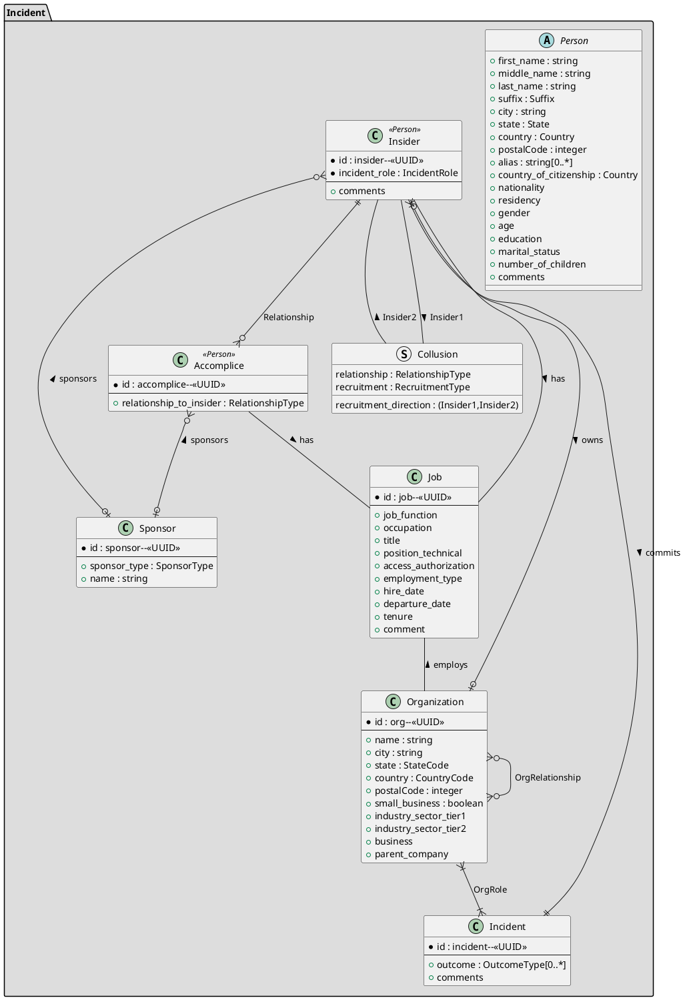

## uml: sequence diagram
reference: https://plantuml.com/class-diagram

Django models
- court case
- charge
- sentence
- motive
- substance abuse
- psycological factors
- Incident
- source
- observable
- impact
- target

TODO 
- make sure all of the "CHOICES" options are in the enumerations 

