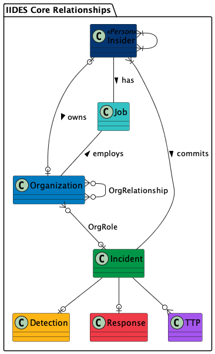
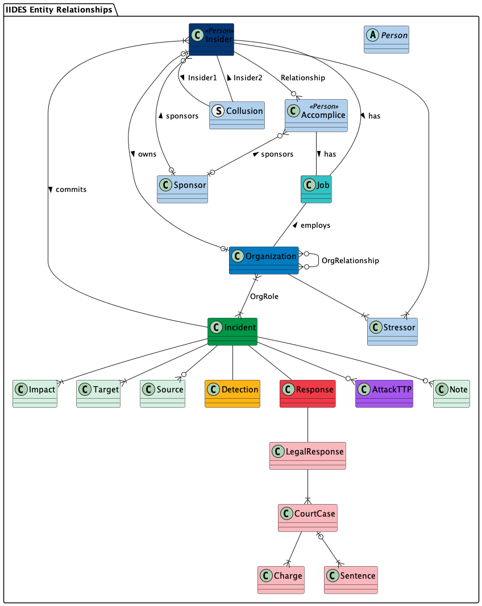

# Insider Incident Data Exchange Standard

Author: [TEAM]

Date: April 26, 2024

Version: 0.1, Revision 1

## Introduction

TODO - Intro

## Background

TODO - Background

- bit about MERIT
- bit about our other research
- users: researchers, analysts, risk managers, practitioners, investigators, simulations/exercises
- general happenings in the InT world

## Guiding Principles

The development of IIDES, as with the development of many standards, required a trade off between a fully articulated, tightly constrained schema and a language flexible enough to be useful across a range of potential applications. We balanced these trade offs by adhering to the following set of guidelines when deciding on each particular element of IIDES.

**Simplicity** - 
Support the individuals and organizations who do the hard work of analyzing insider incidents by providing the tools and language to do their work as efficiently as possible, without unncessary constraints, abstractions, or requirements.

**Expertise** - 
The elements that make up the standard should be based on a mix of direct experience, emprical data, analysis, and theoretical observations. The standard should be directly applicable to current operational practice but also support the advancement of the state of the art.

**Flexibility** - 
Support different users, use cases, and needs by not overconstraining the schema and limiting requirements. Allow for different users to facilitate their use cases by adding their own constraints, fields, or  vocabularies in local implementations. Respond to and incorporate community feedback regarding changes to the standard or the schema.

**Interoperability** - 
Be aware of related work and, when possible, allow for compatibility and interoperability with existing standards. Support referencing of other standards rather than redefining existing work within the schema.

## Related Standards

TODO - Related standards

We believe IIDES fills a need... Insider threat is nichee, but it touches a variety of other domains... 

Insider Threat
- Indicator Ontology
- SOFIT: https://ieeexplore.ieee.org/document/8424651

Cyber:
- ATT&CK and InT ATT&CK
- STIX/TAXII
- MISP
- SISO CyberDEM

Risk:
- NIST Risk framework and/or incident framework
- RMM

Other General Standards
- NIACS, ANSI, ISO

## Benefits
TODO - Benefits

IIDES is designed to provide a range of beneifts across a broad array of potential users in both research and operational environments. Ideally, IIDES will **support efficient sharing** of incident data among practioners, organizations, and researchers by providing a shared naming convention for details that may be included in incident data. It will provide a **foundational vocabulary** for organizations collecting their own incident data and **ease development** of new data collection and case management systems...[ that can talk to each other]

We hope that IIDES will also help **guide data collection** efforts for both researchers and organizations to improve... research....

Allow for a more consistent mapping of recommendations and best practices for response, detection, and mitigation. 

## IIDES Architecture

IIDES is split into four different sections: the seven core components, additional subcomponents, relationshps, and vocabularies. 

### Core Components

The core components of IIDES are Incident, Insider, Organization, Job, Detection, Response, and TTP. Figure X describes the relationships between these core components. 

None of the components in IIDES are required. An organization using IIDES may choose to one, all, or some subset of the avaialable components. To have a valid schema, the relationships are required as described in the schema [documentation](../).

An insider threat [Incident](objects/incident.md) can be associated with one or more [Insiders](objects/insider.md) who commited the incident. Those insiders may either be employed by, or own, one or more [Organizations](objects/organization.md) involved in the incident. The specific details of an employment relationship are contained in the [Job](objects/job.md) entity.

When multiple organizations are involved in an incident, they may have relationships to one another, such as a vendor relationship, or a competitor relationship. Organizations may also have different roles within an incident, such as a primary victim, or even a beneficiary of the incident.

A [Detection entity](objects/detection.md) describes details about how, when, and by whom the incident was detected. An incident has only one detection entity.

A [Response entity](objects/response.md) describes the organization's response to the incident, including technical and behavioral controls, investigation, and legal response. An incident has only one response entity. 

An incident can have zero, one, or multiple [TTPs](objects/ttp.md), each of which details a specific action the insider took during the course of the incident.

### Full Architecture

The full architecture of IIDES includes a number of subcomponents that are associated with one or more of the IIDES core components.

The Incident core component includes the subcomponents [Target](objects/target.md), [Impact](objects/impact.md), [Note](objects/note.md), and [Source](objects/source.md). An incident can have zero, one, or more of each of these subcomponents. A target is the system, data, person, or physical property that was targeted by the insider. An impact is a quantitative measurement of the impact of the incident on the victim organization. A note is used for keeping details unrelated to the incident, such as case management notes or research references. Sources are documents and files related to the incident or its investigation.

The Response core component can have a [legal response](objects/legal-response.md) subcomponent, which in turn has one or more [court case](objects/court-case.md) components, each of which can have one or more [charge](objects/charge.md) and/or [sentence](objects/sentence.md) components. These subcomponents are intended to capture specific details about incidents that go through the legal system.

An Organization can be connected to one or more employment [stressors](objects/stressor.md) which impact an insider within the organization. These stressors are defined by the stressor vocabularies, and include stressors such as getting passed over for a promotion.

An Insider can be connected to one or more other insiders through the [collusion](structs/collusion.md) structure, and may have one or more [accomplices](objects/accomplice.md) external to the organization. An Accomplice may be tied to an organization through a Job entity when relavant to the incident. Both accomplice and insider inherit many of their properties, such as name, gender, and location, from the [Person](objects/person.md) subcomponent. Accomplices and/or insiders may have a [Sponsor](objects/sponsor.md) such as a foreign government or corporate competitor.

The Detection and TTP core components do not have any additional subcomponents.

### Relationships

IIDES components are connected to one another through relationships. We have tried not to overspecify the relationships in IIDES, as doing so would be a violation of our guiding principles of simplicity and flexibility. However, we do specify as part of the schema the relationships which we believe are important to facilitating a clear understanding of an insider incident.

We refer to a group of components all related to one another through a particular incident as an "incident bundle". Though we understand that it is theoretically possible to have an insider or organization connected to more than one incident (e.g., an organization that has an incident in one year, then a separate incident the next year), we recommend that implementations only include one incident in each bundle. This simplifies the technical implemenation of the schema and ensures the data remains readable by human analysts. 

The schema does not require inclusion of an incident entity. However, we highly recommend including the incident entity, with null fields if necessary (except for `id`), as it provides the connective glue between the other components of IIDES and will allow for consistent sharing of incidents across organizations, should the need arise.

The relationships specified in IIDES are are detailed in the description of each component, as well as in the IIDES [ERD](../UML/out/) files. Implementations can more tightly constrain the relationships should they have a need to do so, for example by requiring every incident have at least one insider, organization, and target. Implementations should not more loosely define the relationships, for example by allowing an incident to have multiple detection components. Doing so would result in a non-conformant implementation.

The generic [relationship struct](structs/relationship.md) is provided for connecting entities to one another as specified by the relationships in the schema. For example, the generic relationship struct would be used to connect an insider entity with a job entity. Some relationships have additional properties relevant to the relationship and are therefore specified separately from the generic relationship struct in IIDES. These include [Collusion](structs/collusion.md), organization [ownership](structs/org-owner.md) by an insider, and [relationships between organizations](structs/org-relationship.md).

The existing generic relationship struct should not be used for connecting entities that do not have relationships specified by the schema. For example, an implementation may require a way to connect a specific impact to a specific TTP, or to connect a specific source to a specific target. These relationships are not specified in IIDES. Before implementing a custom relationship for such entities, we suggest making a request for inclusion of such a new relationship in IIDES via the IIDES GitHub page.

### Vocabularies

Many of the components in IIDES include properties which require values from specific vocabularies (enumerations) included with IIDES. For example, the `incident_type` property of the [Incident](objects/incident.md) component requires a value from the [incident-type-vocab](objects/incident.md#incident-type-vocab), which lists Fraud, Sabotage, Espionage, Violence, and Unintentional as the options for `incident_type`.  The vocabularies in IIDES are based on our own extensive experience working with insider incidents as well as on a large collection of incident data.

Most vocabularies in the IIDES schema are specified as subschemas with a mapping of constants to their titles and description, as opposed to a simple list of values (i.e., an enumeration). For example, the allowed values for the `incident_type` propertiy are only "F", "S", "E", "V", and "U". This specification of constants is intended to keep the stored data as small as possible, as well as to provide consistent definitions of the vocabulary terms across the IIDES user base and insider threat community at large. 

Using subschemas also provides flexibility for local implementations that may wish to use different value titles without breaking the schema requirements or affecting shareability. For example, an organization wishing to use the term "non-malicious" instead of "unintentional" may swap out the mapping of the title to the constant "U" from "Unintentional" to "non-malicious" without invalidating their implementation. Another organization may use a translation of the titles and descriptions to another language, while keeping the constants as is. Organizations may also clarify descriptions for their own internal purposes in the same way, e.g., by adding guidance for analysts deciding which value to use.

It is diffult to provide full coverage for all possible vocabulary terms across all use cases of a data standard. We request that organizations which find that the necessary vocabulary terms are missing for their use case, provide feedback via the IIDES GitHub page before considering making internal changes to the vocabularies. This way, new terms may be considered for inclusion in an updated version of IIDES and be made available for other organizations with similar use cases.

## Using IIDES
TODO - using IIDES

We recognize that not all components of IIDES will be useful to all users. To that end, ...

- Using the schema
  - gotchas with json schemas

To assist with understanding the json schema, we provide a set of [examples](../examples/) which cover several incident types and use cases. The examples are not intended to be exhaustive of all possible use cases, but to provide insight into how to provide valid data to the schema, as well as to assit with testing alternative implementations of IIDES.

- Existing implementations (Termite, pyIides)
- advice for implementing
  - implement as tightly as possible to the schema (reference the ERDs and schema descriptions for relationship specifics; reference pyiides for an existing implemenation of the schema was applied)
  - request changes directly to IIDES via github, before implementing a non-standard schema

We welcome community feedback and suggestions for enhancement, which can be submitted via the IIDES GitHub page as issues, discussions, or pull requests.

## Conclusion
TODO - conclusion

## References

The following is a list of references included in this document, as well as those referenced in the IIDES schema files.

1. Cyber Data Exchange Model (DEM) Product Development Group - Simulation Interoperability Standards Organization (SISO). (2023). Cyber Data Exchange Model (DEM).
2. Cybersecurity and Infrastructure Security Agency. Defining Insider Threats. Retrieved May 23, 2024 from https://www.cisa.gov/topics/physical-security/insider-threat-mitigation/defining-insider-threats
3. Greitzer, F.L. (2014). Unintentional Insider Threat: Contributing Factors, Observables, and Mitigation Strategies. *47th Hawaii International Conference on System Science*.
4. ISO 3166 Maintenance Agency: International Organization for Standardization. ISO 3166 Country Codes. Retrieved May 2024 from https://www.iso.org/obp/ui/.
5. Merah, Y. Kenaza, T. (2021). Ontology-based Cyber Risk Monitoring Using Cyber Threat Intelligence. *ARES '21: Proceedings of the 16th International Conference on Availability, Reliability and Security, 88, 1–8. doi: 10.1145/3465481.3470024.
6. Spaeth, H.J., Epstein, L., et al. (2019). Supreme Court Database, Version 2019 Release 1. URL: http://Supremecourtdatabase.org

## Licensing and RRO
TODO - RRO

