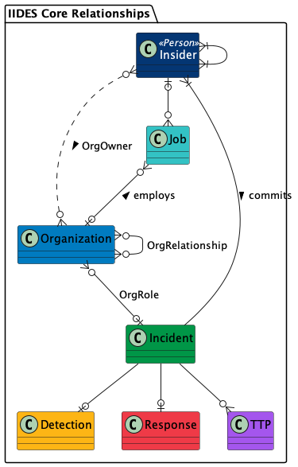

# Insider Incident Data Exchange Standard

Author: CERT Insider Threat Center  
Date: July 2024  
Version: 1, Revision 1

## Introduction

Insider threat and risk management are not themselves new phenomena, but they do represent a relatively nascent field of study. While the CERT Division's research in the field was already a decade old when the Software Engineering Institute (SEI) published *The CERT Guide to Insider Threats* in 2012 [[Cappelli 2012](#references)], the area as a field of study is itself still relatively young, encompassing many different fields, disparate sources of legal and policy mandates, and several schools of thought. In much the same way that research around insider threat is still growing and coalescing, practitioners are still working out best practices around technical defenses, behavioral and human elements mitigations, and methods for storing and exchanging incident data.

The Insider Incident Data Exchange Standard (IIDES) exists to expand on that last point&mdash;how can we best store and exchange insider threat case data? What are the best ways to craft and apply the appropriate taxonomy to case data? Perhaps most importantly, which types of individuals stand to benefit from this work, and how might they best use such a framework to assure mutually intelligible information sharing?

While practitioners have performed some work around information schema and information portability as it relates to general cybersecurity data, we seek in this paper and the associated standard to provide guidance and structure around the coding, storage, and sharing of data related specifically to insider incidents of all kinds. This work is built upon the work of *The CERT Guide to Insider Threats*, our continually updated collection of best practices in the *Common Sense Guide to Mitigating Insider Threats* [[Software Engineering Institute 2022](#references)], as well as two decades of work and corpus curation around MERIT, our insider threat case database.

## Background

The study and management of insider threat and risk remain areas of increasingly growing attention, prevalence, and concern. According to the *2024 Verizon Data Breach Incident Report*, 35% of breaches are perpetrated by organizational insiders [[Verizon 2024](#references)]. Further, the Ponemon Institute has attempted to assign costs to these phenomena: malicious insider incidents cost organizations an annual average of $701,500. At roughly seven events per year per organization, the average annualized costs of malicious insider incidents become $4,840,350. Add in non-malicious and credential theft, and the average annualized costs jumps to $16,226,605 [[Ponemon Institute 2023](#references)]. Taken together, we can state confidently that in terms of both occurrence and costs, the threat posed by trusted insiders is as grave an issue as ever.

Several classes of stakeholders stand to benefit from this work. Research into insider threat is often stymied early by a lack of data. A standard of case classification and information sharing could allow researchers to build, maintain, and share insider threat case data. Similarly, practitioners&mdash;namely analysts, investigators, and those responsible for risk management&mdash;stand to benefit from ways in which to build internal case corpora and share that data with other practitioners, other similar businesses or entities, and third-party organizations such as law enforcement, governmental agencies, or research organizations. Such methods would also be of benefit for sharing case information with those who create models and simulations, training, education, and best practices.

## Guiding Principles

The development of IIDES, as with the development of many standards, required a tradeoff between a fully articulated, tightly constrained schema and a language flexible enough to be useful across a range of potential applications and users. We balanced these tradeoffs by adhering to the following set of guidelines when deciding on each particular element of IIDES.

**Simplicity**&mdash;Support the individuals and organizations who do the hard work of analyzing insider incidents by providing the tools and language to do their work as efficiently as possible and without unnecessary constraints, abstractions, or requirements.

**Expertise**&mdash;The elements that make up IIDES should be based on a mix of direct experience, empirical data, analysis, and theoretical observations. IIDES should be directly applicable to current operational practice and support the advancement of the state of the art.

**Flexibility**&mdash;Support different users, use cases, and needs by not over constraining the schema or adding too many requirements. Allow for different users to facilitate their use cases by adding their own constraints, fields, or vocabularies in local implementations. Respond to and incorporate community feedback regarding changes to IIDES or the schema.

**Interoperability**&mdash;Be aware of related work and, when possible, allow for compatibility and interoperability with existing standards. Support referencing of other standards rather than redefining existing work within the schema.

## Related Standards

An array of frameworks, standards, and guidelines aimed at mitigating risks supports current landscape of insider threat management. Notable among these are
- *Common Sense Guide to Mitigating Insider Threats* developed by the SEI [[Software Engineering Institue 2022](#references)], which offers valuable guidelines for organizations to safeguard against internal threats
- *An Insider Threat Indicator Ontology (CMU/SEI-2016-TR-007)* [[Costa 2016](#references)], which provides a method for describing indicators of insider risk
- the MITRE ATT&CK framework [[MITRE 2024](#references)], which provides a comprehensive matrix of tactics and techniques used by adversaries
- the insider-threat-specific version of ATT&CK [[MITRE Engenuity 2024](#references)]

The Cybersecurity and Infrastructure Security Agency’s (CISA’s) *Insider Threat Mitigation Guide* [[CISA 2020](#references)] and the Department of Homeland Security's (DHS's) Insider Threat Program (ITP) [[DHS 2020](#references)] further contribute by delivering strategic insights and structured methodologies for threat detection and prevention . 

Additionally, the DHS Privacy Impact Assessment (PIA) for *Insider Threat Reporting Mobile Platform (DHS/ALL/PIA-068)* [[10](#references)] emphasizes the importance of privacy considerations in threat reporting. Standards like STIX/TAXII (Structured Threat Information eXchange/Trusted Automated eXchange of Indicator Information) [[11](#references)], MISP [[12](#references)], and CyberDEM [[13](#references)] facilitate the standardized exchange of cyber threat intelligence and simulations, while the Cyber Incident Reporting Framework (CIRF) outlines protocols for incident documentation and communication [[14](#references)]. Furthermore, technical standards such as OpenIOC (Open Indicators of Compromise) [[15](#references)], MAEC (Malware Analysis Reporting Exchange Format) [[16](#references)], CAPEC (Common Attack Pattern Enumeration and Classification) [[17](#references)], and CVE (Common Vulnerabilities and Exposures) [[18](#references)] provide detailed specifications for identifying and reporting various cyber threats and vulnerabilities. 

Notably, the bulk of these works are focused on the most technical aspects of cyber and insider incidents. Though some, such as *SOFIT: Sociotechnical and Organizational Factors for Insider Threat* [[Greitzer 2018](#references)], focus on sociotechnical, organizational, or behavioral factors of insider threats. At a higher level, risk management frameworks such as NIST's *Risk Management Framework for Information Systems and Organizations* [[Ross 2018](#references)], *The NIST Cybersecurity Framework (CSF) 2.0* [[NIST 2024](#references)], and the *CERT Resilience Management Model (CERT-RMM) Version 1.2* [[Caralli 2016](#references)] focus on identifying organizational risks and addressing the gaps that lead to those risks. IIDES provides a standard for addressing the gap left by existing frameworks and ontologies to connect the technical, cyber, behavioral, and risk components of the insider threat domain into one easily referenced standard.

The IIDES schema builds off of lessons learned from the frameworks and standards described above and also references more general standards where appropriate, such as North American Industry Classification System (NAICS) standards for industry and occupation [[Executive Office of the President 2022](#references)] and the International Organization for Standardization (ISO) [[International Organization for Standardization 2024](#references)] for location codes. It leverages some of CISA's insider threat categories [[CISA 2024](#references)] and leaves room to reference any of the existing cyber frameworks and repositories.

## Benefits

IIDES is designed to provide a range of benefits across a broad array of potential users in both research and operational environments. Ideally, IIDES will support efficient sharing of incident data among practitioners, organizations, and researchers by providing a shared naming convention for details that may be included in incident data. We hope that this will support a more consistent mapping of recommendations and best practices for response, detection, and mitigation of insider threats in the future.

 IIDES also provides a foundational vocabulary for organizations collecting their own incident data and eases development of new data collection and case management systems for reporting and tracking incidents. Without clear and consistent reporting mechanisms, organizations risk delays in detecting and responding to insider threats as well as inconsistencies in data collection and analysis. Additionally, inadequate reporting procedures may result in missed opportunities for early intervention and mitigation, leaving organizations vulnerable to insider attacks. By implementing IIDES, organizations can streamline reporting processes, improve data accuracy and reliability, and enhance their overall resilience against insider threats.  

## IIDES Architecture

IIDES is split into four different sections: the seven core components, additional subcomponents, relationships, and vocabularies. 

### Core Components

The core components of IIDES are Incident, Insider, Organization, Job, Detection, Response, and TTP. Figure 1 describes the relationships between these core components. 

  
*Figure 1: IIDES Core Components*

None of the components in IIDES are required by the schema. An organization using IIDES may choose to use one, all, or some subset of the available components. To have a valid schema, the relationships must be implemented as described in the schema [documentation](../).

An insider threat [Incident](objects/incident.md) can be associated with one or more [Insiders](objects/insider.md) who committed the incident. Those insiders may either be employed by or own one or more [Organizations](objects/organization.md) involved in the incident. The specific details of an employment relationship are contained in the [Job](objects/job.md) entity.

When multiple organizations are involved in an incident, they may have relationships to one another, such as a vendor relationship or a competitor relationship. Organizations may also have different roles within an incident, such as a primary victim or even a beneficiary of the incident.

A [Detection entity](objects/detection.md) describes details about how, when, and by whom the incident was detected. An incident has only one detection entity.

A [Response entity](objects/response.md) describes the organization's response to the incident, including technical and behavioral controls, investigation, and legal response. An incident has only one response entity. 

An incident can have zero, one, or multiple [TTPs](objects/ttp.md), each of which details a specific action the insider took during the course of the incident.

### Full Architecture

The full architecture of IIDES includes a number of subcomponents that are associated with one or more of the IIDES core components as outlined in Figure 2.

  
*Figure 2: IIDES Full Relationship Diagram*

The Incident core component includes the subcomponents [Target](objects/target.md), [Impact](objects/impact.md), [Note](objects/note.md), and [Source](objects/source.md). An incident can have zero, one, or more of each of these subcomponents. A target is the system, data, person, or physical property that the insider targeted. An impact is a quantitative measurement of the impact of the incident on the victim organization. A note is used for keeping details unrelated to the incident, such as case management notes or research references. Sources are documents and files related to the incident or its investigation.

The Response core component can have a [legal response](objects/legal-response.md) subcomponent, which in turn has one or more [court case](objects/court-case.md) components, each of which can have one or more [charge](objects/charge.md) or [sentence](objects/sentence.md) components. These subcomponents are intended to capture specific details about incidents that go through the legal system.

An Organization can be connected to one or more employment [stressors](objects/stressor.md) that impact an insider within the organization. These stressors are defined by the stressor vocabularies and include stressors such as getting passed over for a promotion.

An Insider can be connected to one or more other insiders through the [collusion](structs/collusion.md) structure and may have one or more [accomplices](objects/accomplice.md) external to the organization. An Accomplice may be tied to an organization through a Job entity when relevant to the incident. Both accomplice and insider inherit many of their properties&mdash;such as name, gender, and location&mdash;from the [Person](objects/person.md) subcomponent. Accomplices and insiders may have a [Sponsor](objects/sponsor.md), such as a foreign government or corporate competitor.

The Detection and TTP core components do not have any additional subcomponents.

### Relationships

IIDES components are connected to one another through relationships. We have tried not to over specify the relationships in IIDES, as doing so would be a violation of our guiding principles of simplicity and flexibility. However, we do specify as part of the schema which relationships we believe are important to facilitating a clear understanding of an insider incident.

We refer to a group of components all related to one another through a particular incident as an &#8220;incident bundle&#8221;. Though we understand that it is theoretically possible to have an insider or organization connected to more than one incident (e.g., an organization that has an incident in one year, then a separate incident the next year), we recommend that implementations only include one incident in each bundle. This simplifies the technical implementation of the schema and ensures the data remains readable by human analysts and researchers. 

The schema does not require inclusion of an incident entity. However, we strongly recommend including the incident entity&mdash;with null fields if necessary (except for `id`)&mdash;as it provides the connective glue between the other components of IIDES and will allow for organizations to consistently share incidents, should the need arise.

The relationships specified in IIDES are detailed in the description of each component as well as in the IIDES [ERD](../UML/out/) files. Implementations can more tightly constrain the relationships, should they have a need to do so, for example by requiring every incident have at least one insider, organization, and target. Implementations should not define the relationships more loosely, for example by allowing an incident to have multiple detection components. Doing so would result in a non-conformant implementation.

We provided a generic [relationship struct](structs/relationship.md) for connecting entities to one another as specified by the relationships in the schema. For example, the generic relationship struct would be used to connect an insider entity with a job entity. Some relationships have additional properties relevant to the relationship and are therefore specified separately from the generic relationship struct in IIDES. These include [Collusion](structs/collusion.md), organization [ownership](structs/org-owner.md) by an insider, and [relationships between organizations](structs/org-relationship.md).

The existing generic relationship struct should not be used for connecting entities that do not have relationships specified by the schema. For example, an implementation may require a way to connect a specific impact to a specific TTP or to connect a specific source to a specific target. These relationships are not specified in IIDES. Before implementing a custom relationship for such entities, we suggest making a request for inclusion of such a new relationship in IIDES via the IIDES GitHub page.

### Vocabularies

Many of the components in IIDES include properties that require values from specific vocabularies (enumerations) included with IIDES. For example, the `incident_type` property of the [Incident](objects/incident.md) component requires a value from the [incident-type-vocab](objects/incident.md#incident-type-vocab), which lists Fraud, Sabotage, Espionage, Violence, and Unintentional as the options for `incident_type`.  The vocabularies in IIDES are based on our own extensive experience working with insider incidents as well as on a large collection of incident data. We expect some of these vocabularies to grow and change over time to better suit the needs of the IIDES user community.

Most vocabularies in the IIDES schema are specified as subschemas with a mapping of constants to their titles and description, as opposed to a simple list of values (i.e., an enumeration). For example, the allowed values for the `incident_type` propertiy are only "F", "S", "E", "V", and "U". This specification of constants is intended to keep the stored data as small as possible, as well as to provide consistent definitions of the vocabulary terms across the IIDES user base and insider threat community at large. 

Using subschemas also provides flexibility for local implementations that may wish to use different value titles without breaking the schema requirements or affecting shareability. For example, an organization wishing to use the term "non-malicious" instead of "unintentional" may swap out the mapping of the title to the constant "U" from "Unintentional" to "non-malicious" without invalidating their implementation. Another organization may use a translation of the titles and descriptions to another language, while keeping the constants as is. Organizations may also clarify descriptions for their own internal purposes in the same way, e.g., by adding guidance for analysts deciding which value to use.

It is difficult to provide full coverage for all possible vocabulary terms across all use cases of a data standard. We request that organizations that find that the necessary vocabulary terms are missing for their use case provide feedback via the IIDES GitHub page before considering making internal changes to the vocabularies. This way, we may consider including new terms in an updated version of IIDES, making them available for other organizations with similar use cases.

## Using IIDES

We recognize that not all components of IIDES will be useful to all users. To that end, we have tried to provide a flexible schema that covers as many use cases as possible without limiting its application in use cases that we have not thought of.

To assist with understanding the JSON schema and IIDES itself, we provide a set of [examples](../examples/), which covers several incident types and use cases. The examples are not intended to be exhaustive of all possible use cases. Rather, they are intended to provide insight into what valid IIDES data looks like, and to provide a small set of test cases to assist with testing alternative implementations of IIDES.

### General Guidance

No matter how well a standard is defined, there will always be cases where the data does not perfectly match the fields that the standard provides. This section includes some guidance on how to code edge cases where the incident data does not perfectly match IIDES.

- **Inexact dates**&mdash;Sometimes incident coders or analysts do not have an exact date available, but instead have something like &#8220;May 2024,&#8221; &#8220;fall of 2020,&#8221; or &#8220;early 2023.&#8221; For these instances, we suggest using the beginning date of the time frame. For example, &#8220;May 2024&#8221; would be &#8220;2024-05-01,&#8221; whereas &#8220;fall of 2023&#8221; would be &#8220;2023-09-01,&#8221; and &#8220;early 2023&#8221; would be &#8220;2023-01-01.&#8221; 
  - Note: Those conducting analysis on large incident data sets with a lot of inexact dates will need to control for any resulting cyclicality in time series data.
- **Lifetime sentences**&mdash;Sentencing information requires a specific numeric quantity that &#8220;lifetime&#8221; does not conform to. To comply with the schema and support quantitative analysis of IIDES-specified incidents, we suggest using the integer &#8220;60&#8221; as the quantity in the sentencing entity.

### Implementation Guidance

We chose to use JSON to define the IIDES schema, as JSON is one of the most widely used data interchange formats and is arguably easier to use than XML. However, JSON does have its drawbacks as a language for defining schemas. For example, it is difficult to directly specify many-to-many relationships, and it assumes that undefined entities are allowed by default. Explicitly stating that additional properties and objects are disallowed would violate our guiding principle of flexibility. For this reason, the IIDES schema is defined only in part by its JSON specification. Additional details for implementation can be found in this white paper, the descriptions of each component (found in the [documentation](.) folder), and the entity relationship diagrams (ERDs) located in the [UML](../UML/out/) files.

We also provide a separate reference implementation of IIDES, called PyIIDES, written in Python, for those who wish to reference a schema-comformant, complete implementation. PyIIDES is a python package available for download and use in other tools or IIDES implementations. One such example of a tool using PyIIDES is Termite, a lightweight, IIDES-compliant insider threat case management solution.

For those writing implementations of IIDES in other languages, we suggest conforming as tightly as possible to the IIDES schema as specified in these documents and the reference implementations. We request that community members requiring a non-standard or non-comformant implementation of IIDES make a request to the IIDES development team via the GitHub page before implementing a custom schema. Doing so provides the team an opportunity to improve IIDES and its associated implementations for use by the community.

## Conclusion

Though extensive, existing tools and guidelines do not collectively address the need for a unified insider threat data exchange standard. Other frameworks and standards are often focused on specific aspects of threat management, such as external attacks, cyber threat intelligence sharing, or procurement regulations, rather than on creating a holistic, standardized approach to collecting and reporting insider threat incidents. This fragmentation leads to inconsistencies in how insider threats are reported, analyzed, and mitigated across different organizations and sectors.

IIDES addresses the critical need for an insider threat data standard that integrates these disparate elements into a cohesive framework, ensuring uniformity and effectiveness in addressing insider threats. 
It provides a mechanism for information sharing and collaboration among stakeholders by leveraging best practices and lessons learned from existing policies and frameworks. 

It is our hope that IIDES will serve as a valuable tool for enhancing insider threat management capabilities across organizations. We welcome community feedback and suggestions for enhancement, which can be submitted via the IIDES GitHub page as issues, discussions, or pull requests.

## References

The following is a list of references included in this document, as well as those referenced in the IIDES schema files.

1. Cappelli, Dawn M., Andrew P. Moore, and Randall F. Trzeciak. *The CERT Guide to Insider Threats: How to Prevent, Detect, and Respond to Information Technology Crimes.* 1st ed. Addison-Wesley Professional, 2012.
2. Software Engineering Institute. “Common Sense Guide to Managing Insider Threats, Seventh Edition.” White Paper. Common Sense Guide to Mitigating Insider Threats. Pittsburgh, PA: Software Engineering Institute, Carnegie Mellon University, September 2022. https://resources.sei.cmu.edu/library/asset-view.cfm?assetid=886874.
3. Verizon. “Data Breach Investigations Report 2024.” Data Breach Investigations Report. Verizon, 2024.
4. Ponemon Institute. “2023 Cost of Insider Threats Global Report.” Ponemon Institute, September 2023.
5. D. Costa, M. Albrethsen, M. Collins, S. Perl, G. Silowash, and D. Spooner, "An Insider Threat Indicator Ontology," Carnegie Mellon University, Software Engineering Institute's Digital Library. Software Engineering Institute, Technical Report CMU/SEI-2016-TR-007, 10-May-2016.
6. MITRE. MITRE ATT&CK. URL: https://attack.mitre.org. Accessed June 2024.
7. MITRE Engenuity. Insider Threat TTP Knowledge Base. URL: https://center-for-threat-informed-defense.github.io/insider-threat-ttp-kb/. Accessed June 2024.
8. Cybersecurity and Infrastructure Security Agency (CISA). Insider Threat Mitigation Guide. November 2020.
9. Department of Homeland Security (DHS) Insider Threat Program (ITP). URL: https://www.dhs.gov/publication/dhs-all-pia-052-dhs-insider-threat-program. Accessed June 2024.
10. Department of Homeland Security (DHS). Privacy Impact Assessments. URL: https://www.dhs.gov/privacy-impact-assessments. Accessed June 2024.
11. OASIS Open. Structured Threat Information Exchange (STIX)/Trusted Automated Exchange of Intelligence Information (TAXII). URL: https://oasis-open.github.io/cti-documentation/. Accessed June 2024.
12. Wagner, Dulaunoy, Wagener, and Iklody. Malware Information Sharing Platform (MISP). URL: https://www.misp-project.org/. Accessed June 2024.
13. Cyber Data Exchange Model (DEM) Product Development Group - Simulation Interoperability Standards Organization (SISO). (2023). Cyber Data Exchange Model (DEM).
14. Cyber Threat Alliance. Cyber Incident Reporting Framework: Global Edition. 2023.
15. Mandiant FireEye. OpenIOC (Open Indicators of Compromise).
16. MITRE. MAEC (Malware Analysis Reporting Exchange Format). URL: https://maecproject.github.io/documentation/maec5-docs/#introduction. Accessed June 2024.
17. MITRE. Common Attack Pattern Enumeration and Classification (CAPEC). URL: https://capec.mitre.org/. Accessed June 2024.
18. CVE Program. Common Vulnerabilities and Exposures (CVE). URL: https://www.cve.org/. Accessed June 2024.
19. F. Greitzer, J. Purl, Y. M. Leong and D. E. S. Becker, "SOFIT: Sociotechnical and Organizational Factors for Insider Threat," 2018 IEEE Security and Privacy Workshops (SPW), San Francisco, CA, USA, 2018, pp. 197-206, doi: 10.1109/SPW.2018.00035.
20. National Institute of Standards and Technology. Risk Management Framework for Information Systems and Organizations: A System Life Cycle Approach for Security and Privacy. December 2018.
21. National Institute of Standards and Technology. The NIST Cybersecurity Framework (CSF) 2.0. Februrary 2024.
22. Software Engineering Institute. "CERT Resilience Management Model: Version 1.2". Pittsburgh, PA: Software Engineering Institute, Carnegie Mellon University, Februrary 2016. https://insights.sei.cmu.edu/documents/1629/2016_002_001_514462.pdf
23. U.S. Bureau of Labor. North American Industry Classification System (NAICS). 2022.
24. ISO 3166 Maintenance Agency: International Organization for Standardization. ISO 3166 Country Codes. Retrieved May 2024 from https://www.iso.org/obp/ui/.
25. Cybersecurity and Infrastructure Security Agency. Defining Insider Threats. Retrieved May 23, 2024 from https://www.cisa.gov/topics/physical-security/insider-threat-mitigation/defining-insider-threats

## Acknowledgments
The following individuals have made significant contributions to the development of IIDES. Thank you for your time and effort.

Austin Whisnant  
Nathan Ammerman  
Gaberiel Sha  
Marco Paes  
Luke Osterritter

## Licensing

This file is a part of the Insider Incident Data Exchange Standard (IIDES) – see [https://github.com/cmu-sei/IIDES](https://github.com/cmu-sei/IIDES)
 
Copyright 2024 Carnegie Mellon University.
 
[DISTRIBUTION STATEMENT A] This material has been approved for public release and unlimited distribution.  Please see Copyright notice for non-US Government use and distribution.
 
This work is provided “AS-IS” with “NO WARRANTIES OF ANY KIND – EXPRESS OR IMPLIED” and is licensed under a Creative Commons Attribution-NonCommercial 4.0 International License.
 
Requests for permission for non-licensed uses should be directed to the Software Engineering Institute at permission@sei.cmu.edu.
 
CERT® is registered in the U.S. Patent and Trademark Office by Carnegie Mellon University.
 
DM24-0776
