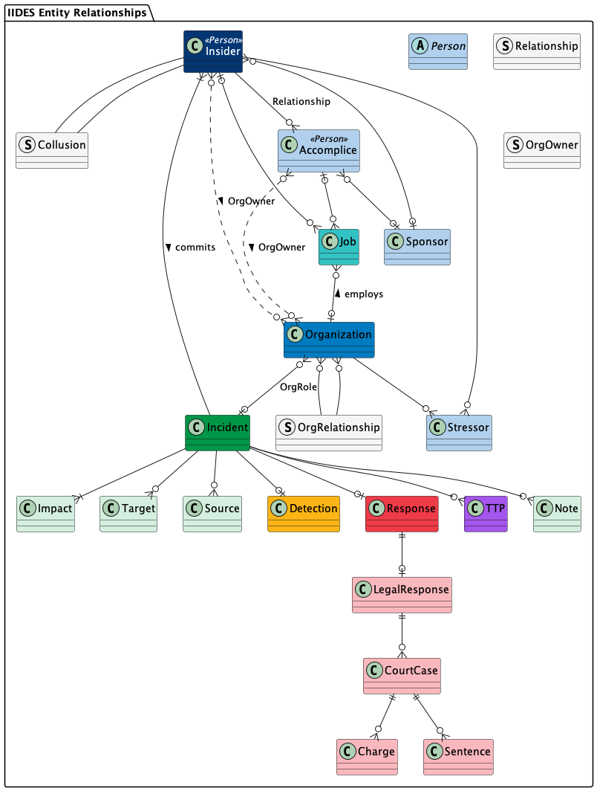

# Insider Incident Data Exchange Standard
Author: [TEAM]
Date: April 3, 2024
Version: 0.1, Revision 1

## Introduction

## Background

- bit about MERIT
- bit about our other research
- users: researchers, analysts, risk managers, practitioners, investigators, simulations/exercises

## Related Work
- NIACS, ANSI, ISO
- Indicator Ontology
- ATT&CK and InT ATT&CK
- NIST Risk framework and/or incident framework
- STIX/TAXII
- MISP
- RMM
- SOFIT: https://ieeexplore.ieee.org/document/8424651
- SISO CyberDEM

- https://ieeexplore.ieee.org/abstract/document/9311246
- https://dl.acm.org/doi/abs/10.1145/3465481.3470024

Legal
- Coding Case Law for Public Health Evaluation (Hall)
- Supreme court database codebook (http://scdb.wustl.edu/_brickFiles/2019_01/SCDB_2019_01_codebook.pdf)
- Measuring law for evaluation research (https://journals.sagepub.com/doi/epdf/10.1177/0193841X10370018

## Guiding Principles
TODO
- Don't redo others' work
- Support the need for flexibility
    - different use cases/needs, different levels of detail/info, different countries (affects vocabularies and titles of constants)
- Compatibility and interoperability
- Lean on our own experience
- Support orgs who do the real work by providing the tools and language to do their jobs as efficiently as possible
- trade offs between sharing (strict constraints on the schema) and flexibility (loose or no constraints)
- implementations can tighten constraints

## Use Cases
TODO
- researchers recreating a database of cases
- maintaining an internal database of an org's own cases
- exchanging case data with other entities
- contributing to a community (ex. OSIT) via semi-open repo
    - requires anon functionality
- influenceing what to collect to support further research and improve their own metrics and lessons learned
- recommend COAs based on input

## IIDES

IIDES is split into four different sections: the seven core components, additional subcomponents, relationshps, and vocabularies. 

### Core Components

The core components of IIDES are Incident, Insider, Organization, Job, Detection, Response, and TTP. Figure X describes the relationships between these core components. 

None of the components in IIDES are required. An organization using IIDES may choose to one, all, or some subset of the avaialable components. To have a valid schema, the relationships are required as described in the schema [documentation](../).

An insider threat [Incident](objects/incident.md) can be associated with one or more [Insiders](objects/insider.md) who commited the incident. Those insiders may either be employed by, or own, one or more [Organizations](objects/organization.md) involved in the incident. The specific details of an employment relationship are contained in the [Job](objects/job.md) entity.

When multiple organizations are involved in an incident, they may have relationships to one another, such as a vendor relationship, or a competitor relationship. Organizations may also have different roles within an incident, such as a primary victim, or even a beneficiary of the incident.

A [Detection entity](objects/detection.md) describes details about how, when, and by whom the incident was detected. An incident has only one detection entity.

A [Response entity](objects/response.md) describes the organization's response to the incident, including technical and behavioral controls, investigation, and legal response. An incident has only one response entity. 

An incident can have zero, one, or multiple [TTPs](objects/ttp.md), each of which details a specific action the insider took during the course of the incident.

### Full Architecture

The full architecture of IIDES includes a number of subcomponents that are associated with one or more of the IIDES core components.

The Incident core component includes the subcomponents [Target](objects/target.md), [Impact](objects/impact.md), [Note](objects/note.md), and [Source](objects/source.md). An incident can have zero, one, or more of each of these subcomponents.

The Response core component can have a [legal response](objects/legal-response.md) subcomponent, which in turn has one or more [court case](objects/court-case.md) components, each of which can have one or more [charge](objects/charge.md) and/or [sentence](objects/sentence.md) components. 

An organization can be connected to one or more employment [stressors](objects/stressor.md) which impact an insider within the organization. These stressors are defined by the stressor vocabularies, and include stressors such as getting passed over for a promotion.

TODO

Insider.... person...

Job...

The Detection and TTP core components do not have any additional subcomponents.

### Relationships

TODO

### Vocabularies

TODO

## Using IIDES
TODO
- Where to send feedback
- Existing implementations (Termite, pyIides) and advice for implementing
- Using the schema
- Examples (link to examples dirs)

## Conclusion
TODO

## References
TODO

## Licensing and RRO
TODO

